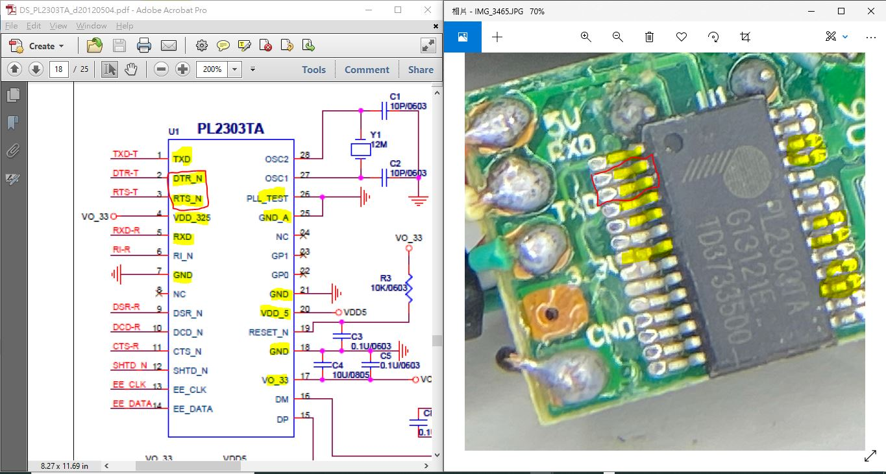

# xiaolaba-PL2303TA_DTR_RTS_pinout_modification
PL2303TA, (EOL by end of 2020), pinout and modification to utilise DTR / RTS

Win10, testing ok
in case need old driver, see this HXA https://github.com/xiaolaba/PL2303HX-HXA-old-driver-for-old-USB-RS232-cables

datasheet, [DS_PL2303TA_d20120504.pdf](DS_PL2303TA_d20120504.pdf)  

pin# and connection, limit current, series with 100 ohm resistor is better.    
  

